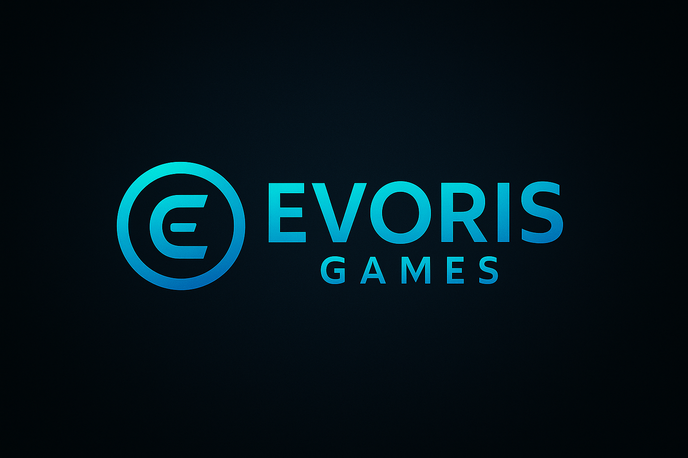

<div align="center">
  
  <h1>EVORIS GAMES</h1>
  <p><strong>Compact strategy, endless loops.</strong></p>

  <p>
    <a href="https://evorisgames.github.io/">Website</a> ·
    <a href="https://x.com/EvorisGames">X (Twitter)</a> ·
    <a href="https://www.youtube.com/@EvorisGames">YouTube</a> ·
    <a href="https://evorisgames.itch.io/">itch.io</a> ·
    <a href="https://github.com/evorisgames">GitHub</a>
  </p>
</div>

---

## About
**Evoris Games** makes short, replayable strategy & automation games for web and PC.  
This repository hosts the **public website on GitHub Pages**.

- Focus: tower defense, automation loops, roguelite progression  
- Cadence: small prototypes and monthly updates  
- Tagline: **Compact strategy, endless loops.**

## Live
- **Main site:** https://evorisgames.github.io/
- Hosted with **GitHub Pages** (branch: `main`, folder: `/`)

## Structure
```
/
├─ index.html         # Landing page
├─ styles.css         # Minimal styles
├─ evoris_icon.png    # 1024x1024 icon (favicon & social)
├─ evoris_header.png  # 1500x500 header (social banner)
├─ og-image.png       # 1200x630 Open Graph image
├─ robots.txt         # Crawler rules
├─ sitemap.xml        # Basic sitemap
└─ .nojekyll          # Disable Jekyll processing
```

## Edit & Deploy
1. Edit files (e.g., `index.html`, `styles.css`).
2. Commit to `main` → Pages deploys automatically.
3. If images don’t show on Pages, check **case-sensitive** file names (e.g., `EvorisEmblem.png` ≠ `evorisemblem.png`).

## Social & SEO
- `index.html` includes Open Graph/Twitter meta tags.
- Update `og-image.png` if the visual changes.
- Keep `robots.txt` and `sitemap.xml` at the root.

## Roadmap (teasers)
- **Project A — Grid Sentinel:** Micro tower defense with auto-build loops.
- **Project B — Factory Bastion:** Factory lines double as your defense grid.
- **Project C — Idle Ramparts:** 5-minute runs, roguelite upgrades, weekly challenges.

## License
- **Site code:** MIT (optional — adjust if needed)
- **Brand & assets (logo, emblem, images):** © 2025 Evoris Games. All rights reserved.

---

### Contact
- X (Twitter): https://x.com/EvorisGames  
- YouTube: https://www.youtube.com/@EvorisGames  
- itch.io: https://evorisgames.itch.io/

---

## 日本語 (簡易)
このリポジトリは **Evoris Games の公式サイト**（GitHub Pages）です。  
`index.html` と `styles.css` を編集して `main` にコミットすれば自動公開されます。  
画像は本番で大文字小文字が区別される点に注意してください。

- 主要ファイル: `index.html`, `styles.css`, `evoris_icon.png`, `evoris_header.png`, `og-image.png`
- OGP対応: `index.html` のメタタグと `og-image.png` を更新
- ライセンス: コードは MIT（任意）、ロゴ等のブランド資産は All rights reserved
